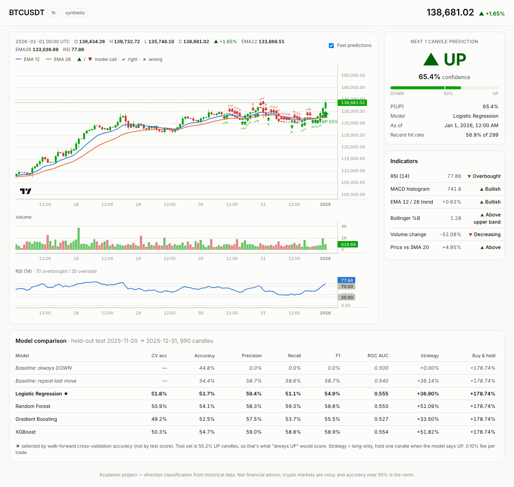

# Cryptocurrency Market Direction Classification Using Machine Learning and Technical Indicators

> **Research question:** Can historical cryptocurrency market data and technical
> indicators be used to classify whether the next trading interval will see an
> upward or downward price movement?

This project trains several classifiers to predict whether the **next candle
closes UP or DOWN**, compares them against naive baselines, and serves the best
one in a web dashboard with a live candlestick chart. A **market scanner**
checks 9 major tokens on 1h/4h/1d candles and alerts you (browser, Telegram or
Discord) when a model that passed the edge check says BUY, and for how long to
hold.

> **Read [Can this make money?](#can-this-make-money) before trading on anything here.**


<sub>Real Binance data, October 2026.</sub>

## Quick start

```bash
python -m venv .venv && source .venv/bin/activate      # Windows: .venv\Scripts\activate
pip install -r requirements.txt

# 1. Download ~7 months of BTC/USDT hourly candles from Binance and train
python -m cryptopredict.train --source binance --symbol BTCUSDT --interval 1h --limit 5000

# 2. One-off prediction in the terminal
python -m cryptopredict.predict

# 3. Train + validate every token/timeframe for the scanner (takes ~30-60 min)
python -m cryptopredict.experiments

# 4. Dashboard at http://127.0.0.1:8000
uvicorn app.server:app --reload

# 5. Optional: scan in the terminal every 15 min and send Telegram/Discord alerts
python -m cryptopredict.scanner --watch 15
```

No internet, or Binance blocked where you are? Use `--source synthetic` to run
the whole pipeline on generated candles, or `--source csv --csv path/to/file.csv`
with any CSV that has `timestamp,open,high,low,close,volume` columns.

Run the tests with `pytest`.

## Other coins and meme coins

Any Binance spot pair works; pass its symbol:

```bash
python -m cryptopredict.train --source binance --symbol PEPEUSDT --interval 1h
python -m cryptopredict.experiments --symbols PEPEUSDT SHIBUSDT BONKUSDT WIFUSDT --intervals 1h 4h   # for the scanner
python -m quant.data download --symbols PEPEUSDT SHIBUSDT BONKUSDT   # 1-minute history for the research engine
ENGINE_SYMBOLS=BTCUSDT,ETHUSDT,PEPEUSDT,SHIBUSDT uvicorn app.server:app   # coins on the engine card (to keep the model specialists' inputs, list all 16 defaults plus the memes)
```

The engine's trend overlay only sizes coins it has been tested on. To test it on
meme coins, download their history, then run the meme study and retrain the
engine. The 22 meme coins are listed in `MEMES` in `quant/studies/meme_coins.py`; DOGE is one of them and is also among the 16 main coins.

```bash
python -m quant.studies.meme_coins     # tests the overlay on every downloaded meme coin
python -m quant.build_engine --retrain # the engine then covers the coins that were tested
```

In Docker, put `docker compose run --rm web` in front of the commands, and set `ENGINE_SYMBOLS` in `.env`.

What is different about meme coins (measured on Binance data, October 2026):

- **Trading costs are higher.** A coin priced at $0.000004 can only move in steps of one "tick", and the spread can never be smaller than one tick. For PEPE, BONK and SHIB that is 18–29 bp, more than the exchange fee. The app adds half a tick per side to every backtest automatically.
- **Accuracy looks better than it is.** On PEPE the classroom model is about 55% "accurate", but that is because most hourly candles close flat or down as the price bounces between ticks. "Always DOWN" scores 57%, so the edge check says NO EDGE. Judge a model by the edge check and the chart's scoreboard, not by its accuracy.
- **Holding them was brutal.** 22 meme coins are still trading on Binance:
  - 17 of them lost money per year since listing;
  - every one fell 79–99% from a peak at some point;
  - from October 2025 to October 2026, an equal-weight basket of them lost 51%.

  Dead and delisted memes aren't in the data, so reality was worse.
- **The trend overlay held up on memes it had never seen.**
  - Its worst drawdown was −28%, versus −94% for buy & hold.
  - Over the last year it lost 3.6%, while buy & hold lost 51%.

  It limits losses; it does not make memes profitable. The engine applies the overlay only to coins it was tested on, and says so for any other coin:
  - a plain `quant.build_engine` covers the 16 main coins;
  - after the meme study and a retrain (below), it covers 37: the 16 main coins and 21 other memes.
- **No short-term meme trading signal was validated.**

## Run with Docker

You need Docker Desktop (Mac/Windows) or Docker Engine with Compose **2.24 or
newer** (Linux; check with `docker compose version`). The image runs on
Intel/AMD and Apple Silicon. Your downloaded data and trained models live in the
`data/` and `models/` folders of the repo, mounted into the container. They
survive rebuilds and are shared with a non-Docker install.

```bash
cp .env.example .env               # optional: alert tokens and settings (see the file)
docker compose build

# Train the classroom model, then start the dashboard at http://localhost:8000
docker compose run --rm web python -m cryptopredict.train --source binance --symbol BTCUSDT --interval 1h --limit 5000
docker compose up -d
docker compose logs -f web         # Ctrl+C stops following, not the app
```

Any `python -m ...` command in this README runs in the container if you put
`docker compose run --rm web` in front of it. For example:

```bash
docker compose run --rm web python -m cryptopredict.experiments   # models for the scanner (30-60 min)
docker compose run --rm web python -m quant.data download          # research data (~3 GB in ./data)
docker compose run --rm web pytest -q                              # test suite
```

Three exceptions:
- **Dashboard:** use `docker compose up -d`, not `uvicorn`.
- **CSV files:** the container only sees `./data` and `./models`. Put CSV files in `./data` and pass `--csv data/<file>.csv`.
- **Outputs:** write them under `data/` or `models/`. Anything else disappears with the container.

Long-running extras are Compose profiles. They restart automatically and read
their settings from `.env`:

```bash
docker compose --profile alerts up -d     # scanner every 15 min -> Telegram/Discord
docker compose --profile recorder up -d   # forward order-book recorder for future research
docker compose --profile "*" down         # stop everything (data and models stay)
```

Plain `docker compose up -d` and `docker compose down` only touch the
dashboard. If you use the extras, list them in `.env`, for example
`COMPOSE_PROFILES=alerts`. Then the plain commands include them, including
updates.

**Updating.** The code is copied into the image, so rebuild after a
`git pull` or after editing any `.py` file:

```bash
docker compose build
docker compose up -d
```

Notes:
- **Network access:** the dashboard listens on this computer only (`127.0.0.1`), because it has no login. To reach it from other devices, set `BIND_ADDR=0.0.0.0` in `.env`. Do that only on a network you trust.
- **Signal engine:** the dashboard's engine card needs `models/engine/`. Until it exists, the card says "not built yet". Build it with one command (see [Research engine](#research-engine--quant)):

  ```bash
  git pull                                                        # the build command is new:
  docker compose build                                            #   update the code and the image first
  docker compose stop web                                         # frees memory for the build
  docker compose run --rm web python -m quant.build_engine        # a few hours; rerun to resume after an error
  docker compose up -d                                            # after it prints "Engine built"
  ```

  - **Progress:** the build also writes to `data/logs/build_engine.log`. Follow it with `tail -f data/logs/build_engine.log`, or in PowerShell with `Get-Content data\logs\build_engine.log -Wait -Tail 20`.
  - **Closing the terminal doesn't stop the build.** It keeps running in its container. Check with `docker ps`, and stop it with `docker stop <container id>`.
  - **Getting your terminal back:** start the build with `docker compose run -d --rm web python -m quant.build_engine`. Then run `docker compose up -d` only once the log ends with "Engine built" or "!! Step failed".
  - **Running it twice:** a second build refuses to start while one is running.
  - **First load:** the engine's first load after each start syncs every coin from Binance and can take a few minutes.
  - **Expect NO TRADE for every coin.** No trading signal passed the holdout test. Only the trend overlay passed, and only as a risk overlay, so the card shows its exposure as position-size guidance, never as a trade.
- **Memory:**
  - the dashboard needs about 1–2 GB, or about 3 GB once the engine is trained;
  - `quant.build_engine`, `quant.train_engine` and any `quant.studies.*` command need about 8 GB. Stop the dashboard first (`docker compose stop web`).

  Give Docker Desktop at least 10 GB before running those:
  - Mac, or Windows with the Hyper-V backend: Settings → Resources.
  - Windows with WSL 2: WSL gets half your RAM by default. If that is less than 10 GB:
    1. add `memory=10GB` under `[wsl2]` in `%UserProfile%\.wslconfig` (never lower a larger value already there);
    2. quit Docker Desktop and run `wsl --shutdown`;
    3. start Docker Desktop again.
- **File ownership on Linux:**
  - **Docker Engine:** the container runs as an unprivileged user with uid 1000. If your user id differs (`id -u`), set `HOST_UID` and `HOST_GID` in `.env` and rebuild, so files written to `data/` and `models/` stay yours.
  - **Rootless Docker, or Docker Desktop for Linux:** set both to `0` instead, because container root maps to your own user there.
  - **Freeing space:** delete the *contents* of `data/`, not the folder. Docker would recreate it owned by root.
- **`toomanyrequests` while building:** Docker Hub has rate-limited image pulls. Set `BASE_IMAGE=mirror.gcr.io/library/python:3.13-slim` in `.env` and build again.
- **Pinned versions:** the image installs the exact package versions the tests passed with (`constraints.txt`). For the same versions natively, use Python 3.12 or newer (tested on 3.13) and run `pip install -r requirements.txt -c constraints.txt`. On older Python, use plain `requirements.txt`.

## Research engine — `quant/`

The `cryptopredict/` app above is the original classroom project. `quant/` is
the research-grade follow-up: an evidence-gated **signal engine** whose default
output is **NO TRADE**. It only signals when a specialist passed a
pre-registered out-of-sample test after realistic costs, its data is fresh, and
a live health monitor hasn't disabled it. The full study, including what
failed, is in **[docs/RESEARCH_REPORT.md](docs/RESEARCH_REPORT.md)**.

**Build the engine (one command).** It runs only the steps the engine needs, skips
the ones already done (so you can rerun it after an error), and logs to
`data/logs/build_engine.log`. Expect a few hours, about 3 GB of downloads and
about 8 GB of memory:

```bash
python -m quant.build_engine --dry-run     # what it will do, and what is already done
python -m quant.build_engine               # Docker: docker compose run --rm web python -m quant.build_engine
python -m quant.build_engine --refresh     # later: update every coin to today, then retrain
```

It runs, in order:
1. `quant.data download`: 1-minute Binance klines for the 16 coins since 2020. Only missing coins are downloaded. To bring coins you already have up to date, use `--refresh`.
2. `quant.studies.execution_realism`: the event rule's research statistics. `train_engine` needs them.
3. `quant.studies.intraday_conversion`, `daily_panel 1` and `daily_panel 3`: these record every research trial in the ledger.
   - `train_engine` deflates each model's Sharpe ratio over those trials.
   - Without them, the models can't pass and are marked NOT_VALIDATED.
4. `quant.train_engine`: freezes the candidates, evaluates each **once** on the locked holdout, and writes `models/engine/`.

`train_engine` builds into `models/engine.new/` and swaps the folder in at the end. A running dashboard therefore keeps showing the previous engine (or "not built yet") until the build is complete. It then loads the new engine on its next refresh, with no restart.

More options:
- `--retrain` reruns only `train_engine`.
- `--refresh` first brings every coin's history up to today and clears the feature caches, then retrains. The research studies use data from before the holdout only, so they stay valid.

**More research studies.** Every other study in `quant/studies/` feeds
[docs/RESEARCH_REPORT.md](docs/RESEARCH_REPORT.md), not the engine. The one
exception is `meme_coins`: it extends the trend overlay to meme coins (see
[Other coins and meme coins](#other-coins-and-meme-coins)). For example:

```bash
python -m quant.data check                 # gaps, outages, bad bars (prints only)
python -m quant.studies.trend              # daily trend vs vol-targeted hold vs random timing -> trend_daily.json
python -m quant.studies.event_hypotheses   # sweeps, cascades, flow reversals, breakouts...
python -m quant.report                     # markdown tables from a fixed set of results
```

`quant.report` prints "not available" for any section whose study hasn't run.

Each study writes its results to `data/results/` (for example `daily_panel_h3.json`) and covers the research period only.

How to read the engine's output:

- **Verdict per coin:** LONG / SHORT only if a *validated* specialist fires. Everything else is NO TRADE, with the reason:
  - insufficient or stale data
  - validated specialists disagree
  - no validated edge clears costs right now
- **Specialist status:**
  - **VALIDATED:** passed the pre-registered holdout criteria.
  - **RISK_OVERLAY:** reduces drawdowns but isn't proven alpha. Its "exposure" is a position-size guide, not a trade.
  - **NOT_VALIDATED:** shown for information only; it never trades.
- **Views agree / conflict:** whether every specialist's directional lean, tradeable or not, points the same way.
- **Entry windows:** research always entered 1 minute after the decision. A signal whose window has passed is NO TRADE until the next decision.
- **Health:** each specialist runs a CUSUM degradation monitor on its live trade results and switches itself off when its edge decays.

Settings for `/api/engine`:

| Variable | Meaning | Default |
|---|---|---|
| `ENGINE_SYMBOLS` | Comma-separated coins to evaluate. Unless the list contains all 16 default coins, the model specialists lose their cross-asset inputs and show "features unavailable" (NO TRADE). To add coins such as memes, list the 16 defaults plus the extras. The trend overlay is unaffected. A coin without downloaded history starts with 8 days of data and fills in older history over the next few refreshes. | all 16 |
| `ENGINE_BOOK=0` | Skip the live order-book liquidity veto | on |
| `ENGINE_TTL` | Seconds to cache the result | 300 |

Order-book hypotheses can't be tested on history (no historical books are
available), so record books going forward and test them later:
`python -m quant.record_book --symbols BTCUSDT ETHUSDT SOLUSDT --every 10`.

## How it works

```
Binance klines ─► indicators & features ─► UP/DOWN target ─► chronological split
                                                                 │
                ┌────────────── walk-forward CV picks the best ◄─┤ train (80%)
                ▼                                                 │
   held-out evaluation vs baselines ◄──────────────────────────── test (20%)
                │
                ▼
   best model refit on all data ─► models/model.joblib ─► dashboard / predict
```

### 1. Data — `cryptopredict/data.py`
OHLCV candles from Binance's public API (no API key). It pages back past the
1000-candle limit, drops the still-forming candle, and falls back to
`api.binance.com` and `api.binance.us` if `data-api.binance.vision` is unreachable.
Downloads are cached in `data/<SYMBOL>_<interval>.csv`.

### 2. Features — `cryptopredict/features.py`
| Indicator | Feature(s) given to the model |
|---|---|
| Returns | 1, 3, 6 and 12-candle % change |
| SMA 20 / 50 | % distance of close from each average |
| EMA 12 / 26 | % gap between the two EMAs (trend) |
| RSI 14 | RSI value (Wilder smoothing) |
| MACD 12/26/9 | MACD, signal and histogram, divided by price |
| Bollinger Bands 20, 2σ | %B (position inside the bands) and band width |
| Volume | % change, and ratio to its 20-candle average |
| Candle shape | high−low range, candle body, 12-candle volatility |

All features are **ratios or oscillators, not raw prices**, so a model trained
when BTC was $60k still makes sense at $100k.

**Target:** `1 (UP)` if `close[t+horizon] > close[t]`, otherwise `0 (DOWN)`.

### 3. Models — `cryptopredict/models.py`
Logistic Regression (baseline ML model), Random Forest, Gradient Boosting
(scikit-learn) and XGBoost. Hyperparameters are deliberately conservative
(shallow trees, big leaves) because noisy market data overfits easily.

### 4. Evaluation — `cryptopredict/train.py`
These are the points a reviewer is most likely to probe:

- **No shuffling.** The data is split by time: first 80% train, last 20% test.
  A random split would let the model "see the future".
- **No look-ahead.** Each feature at time *t* uses only candles up to *t*. A
  unit test (`test_features_do_not_look_ahead`) changes future prices and checks
  that past features stay the same.
- **A gap between train and test.** The last `horizon` training rows are dropped
  so no training label overlaps the test period.
- **Model selection without peeking.** The best model is chosen by
  **walk-forward cross-validation** (`TimeSeriesSplit`) on the training set, not
  by its test score.
- **Baselines.** Every model is compared with *always predict the majority class*
  and *repeat the last move*. A model is only interesting if it beats them.
- **Metrics:** accuracy, precision, recall, F1 and ROC AUC, plus a toy long-only
  backtest with 0.1% fees compared against buy & hold.
- **Explainability:** permutation importance, measured as the drop in test ROC
  AUC when a feature is shuffled.

Outputs in `models/`:
- `report.md` — results table, ready to paste into the paper
- `metrics.json` — every number
- `test_predictions.csv` — out-of-sample predictions
- `model.joblib` — the deployed model

### 5. Dashboard — `app/`
FastAPI backend with a [TradingView Lightweight Charts](https://github.com/tradingview/lightweight-charts)
frontend (vendored under `app/static/vendor`, Apache-2.0). It shows:

- Candlesticks with EMA 12/26, plus synced volume and RSI panes
- The **next-candle call** (▲ UP / ▼ DOWN), its confidence and P(UP)
- Signals for RSI, MACD, EMA trend, Bollinger %B, volume and SMA
- **Past predictions on the chart** (▲/▼ markers, ✓ right / ✗ wrong). Only
  out-of-sample candles are marked: the held-out test set plus candles that
  arrived after training. "Recent hit rate" is computed from these.
- The model comparison table
- A **trade planner** (see below)

The dashboard refreshes every minute. Settings come from environment variables:
- `DATA_SOURCE` — `binance`, `csv` or `synthetic`
- `CANDLES` — number of candles on the chart
- `MODEL_PATH` — trained model to load
- `PLAN_HISTORY` — candles the trade planner replays a plan over (default 2000)

**Trade planner.** Like a long/short position on TradingView, you can set an
entry, a take-profit and a stop-loss, or press **Suggest levels** for a
template (stop 1.5 × ATR away, target at twice that distance). The levels are
drawn on the chart. The levels alone don't predict anything, so the planner
reports these numbers with them:

- **Reward/risk and the break-even win rate after fees.** A 2:1 target needs
  to come first about 1 time in 3 just to cover the payoff, plus fees.
- **A replay on this coin's own history.** The same % distances are tested from
  every past candle (about 2000). It shows how often the target came first, how
  often the stop came first, and how often neither was hit within the max hold.
  It also gives the average result after fees, with a likely range.
- **A comparison with no levels.** It enters at the same moments and simply
  sells after the same number of candles. If the levels didn't beat that,
  any profit came from the trend in that period.
- **Position size.** Enter an account size and a risk %. The planner shows how
  much to buy so that hitting the stop loses exactly that share, fees included.
  It warns if that size would need leverage.

The replay is cautious where candles can't tell what happened:
- If the target and the stop both fall inside one candle, the trade counts as a loss.
- If a candle opens past the stop (a gap), the trade fills at that candle's open.

### 6. Edge check — would it have made money?
Every training run ends with a plain-language verdict, shown at the top of the
dashboard and in `report.md`:

| Verdict | Meaning |
|---|---|
| **POSSIBLE EDGE** | Beat the baselines with statistical significance (p < 0.05) **and** beat buy & hold after fees on unseen data |
| **NO PROFIT** | Significantly more accurate, but the gain doesn't survive fees or doesn't beat buy & hold |
| **UNPROVEN** | Made money on the test period, but not statistically better than the baselines, so the profit is most likely luck |
| **NO EDGE** | Not better than the baselines |

How the check works:
- **The baseline is strict.** It's the best of: always predicting the training majority, repeating the last move, or the best constant guess in hindsight.
- **Confidence threshold.** The model only trades when its confidence passes a threshold. The threshold is chosen on the training period's walk-forward predictions, never on the test period.
- **Many-comparison correction.** `cryptopredict.experiments` tests many configurations, so some will look good by chance. It applies Holm's correction across all of them.

### 7. Market scanner and alerts — `cryptopredict/scanner.py`
The scanner runs every model trained by `cryptopredict.experiments` on the
latest candles. It gives each one a status:

| Status | Meaning |
|---|---|
| **▲ BUY** | Validated model, confident UP call. Buy and hold for the time shown (horizon × candle size), then exit. |
| **▼ AVOID** | Validated model, confident DOWN call |
| **• WAIT** | Validated model, but below its confidence threshold |
| **not validated** | The model failed the edge check. Its prediction is listed for information, **never** as a signal. |

Ways to use it:
- **Dashboard:** the scanner is at the top. Click a row to load that token's chart and model. **Enable alerts** turns on browser notifications for new BUY signals while the page is open.
- **Phone alerts:** run `python -m cryptopredict.scanner --watch 15` with either or both set:
  - Telegram: `TELEGRAM_BOT_TOKEN` and `TELEGRAM_CHAT_ID`. Create a bot with @BotFather, message it once, then read your chat id from `https://api.telegram.org/bot<TOKEN>/getUpdates`.
  - Discord: `DISCORD_WEBHOOK_URL`

Each signal is sent once.

**Retrain regularly.** Markets change, so rerun `cryptopredict.experiments` every week or two. The scanner always uses the latest saved models.

## Can this make money?

**Short answer: not as it stands, and the app will tell you so.**

The research engine took this question much further (see
[docs/RESEARCH_REPORT.md](docs/RESEARCH_REPORT.md)). It used six years of
1-minute data on 16 coins, realistic costs, hundreds of pre-registered tests,
and a locked one-year holdout:

- **No short-term trading signal survived.** Short-horizon direction is slightly predictable, but the edge is smaller than trading costs.
- **The best-looking anomaly was dead out of sample.** Buying altcoins after forced sell-offs made +33 bp per trade in 2020–25 but lost −13.5 bp per trade on the holdout.
- **The one thing that held up is risk control.** A daily trend overlay cut the worst drawdown from −54% to −22% in a falling market it had never seen.

Below are the results for the original classroom app. Here are the
real results. Each configuration was trained on Binance data, then tested on
the most recent 20% of candles that the model never saw. Fees are 0.1% per
trade.

First run, October 2026 (BTC, ETH and SOL × 1h/4h/1d × 1 and 3 candles ahead):
**0 of 18 configurations passed the edge check.**
- The best accuracies were around 52–54%, never significantly above the baselines.
- Strategy returns at the chosen confidence threshold mostly lost to buy & hold.
- Three configurations made money in the test period (ETH 4h, ETH 1d, SOL 1d), but with p-values of 0.3–0.4: the kind of result luck produces when you test many things.

Run `python -m cryptopredict.experiments` to reproduce this on current data. The full table is written to `models/experiments/summary.md`.

Why this is the expected result:
- **Price direction is close to a coin flip.** At these timeframes, past price and volume patterns carry very little information about the next move. Thousands of professional funds trade on the same indicators, so any obvious pattern gets traded away.
- **Fees are the killer.** A model that is 52% right on hourly candles gives up its tiny edge to 0.1% fees on every trade. That's why longer candles and the confidence threshold exist: fewer, stronger trades.
- **"UNPROVEN" rows are a trap.** A few configurations made money on the test period. With dozens of configurations tested, some will do well by luck; the p-values show these did.

If a configuration ever shows **POSSIBLE EDGE**, don't trust it straight away.
**Paper-trade it** (follow the alerts without real money) for several weeks of
new data first. Only consider real money if the edge holds, and only money you
can afford to lose.

*This is an educational project, not financial advice.*

## Experiments to run for the paper

The quickest way is the experiment runner. It trains every combination and
writes one comparison table to `models/experiments/summary.md`:

```bash
python -m cryptopredict.experiments --symbols BTCUSDT ETHUSDT SOLUSDT --intervals 1h 4h 1d --horizons 1 3
```

Or run single configurations; the CLI flags map directly to the research variables:

```bash
# Different coins
python -m cryptopredict.train --symbol ETHUSDT
python -m cryptopredict.train --symbol SOLUSDT
# Different time intervals
python -m cryptopredict.train --interval 15m --limit 10000
python -m cryptopredict.train --interval 4h
python -m cryptopredict.train --interval 1d --limit 2000
# Different prediction horizons (e.g. direction 4 candles ahead)
python -m cryptopredict.train --horizon 4
# Separate output folders keep runs side by side
python -m cryptopredict.train --symbol ETHUSDT --interval 4h --out models/eth_4h
```

To study which indicators matter, edit `FEATURE_COLUMNS` in
`cryptopredict/features.py` and compare runs (ablation study).

## What results to expect

Expect accuracy of roughly **50–58%**. Crypto prices are close to a random
walk at short horizons. Results well above that usually point to a bug (most
often look-ahead leakage), not a discovery. Also check the test set's UP share:
if 55% of test candles went up, 55% accuracy is just "always UP". Report
**ROC AUC** and the comparison with the baselines, not accuracy alone.

## Limitations and future work

- **Market regimes change.** A model trained in a bull market may fail in a bear market. Retrain periodically or use rolling-window training.
- **The backtest is a toy.** It ignores slippage and spread and only holds one candle at a time (horizon = 1).
- **Possible extensions:**
  - An LSTM or Temporal CNN for comparison
  - Sentiment or on-chain features
  - A "no trade" band that only acts when confidence passes a threshold
  - Probability calibration
  - Hyperparameter search inside the walk-forward CV

## Project structure

```
cryptopredict/
  data.py        Binance / CSV / synthetic loaders
  features.py    indicators, features, target
  models.py      classifiers compared in the study
  train.py       evaluation pipeline, edge check + CLI
  experiments.py many tokens x intervals x horizons, with multiple-comparison correction
  scanner.py     live BUY/AVOID/WAIT signals + Telegram/Discord alerts
  predict.py     next-candle prediction + CLI
  planner.py     entry / take-profit / stop-loss replay, break-even and position sizing
quant/           research harness and signal engine (see docs/RESEARCH_REPORT.md)
  data.py        1m kline download/load, quality report, Fear & Greed
  labels.py      next-minute VWAP fills, forward returns
  features.py    point-in-time feature families (flow, shape, momentum, trend, ...)
  validation.py  purged walk-forward folds
  backtest.py    calibration, skill gate, NO-TRADE margins, cost-aware simulation
  metrics.py     calibration, bootstrap, deflated Sharpe, PBO, Diebold-Mariano, HAC
  events.py      event-study machinery with matched placebos
  monitor.py     CUSUM degradation monitor
  engine.py      specialists, consensus verdicts, live gates
  train_engine.py frozen candidates, one-time holdout evaluation
  build_engine.py one command: data, the studies the engine needs, train_engine
  studies/       every experiment, including the ones that failed
app/
  server.py      FastAPI backend (/api/dashboard, /api/scanner, /api/plan, /api/engine)
  static/        dashboard HTML/CSS/JS + vendored chart library
tests/           unit and end-to-end tests
```

*Educational project — not financial advice.*
